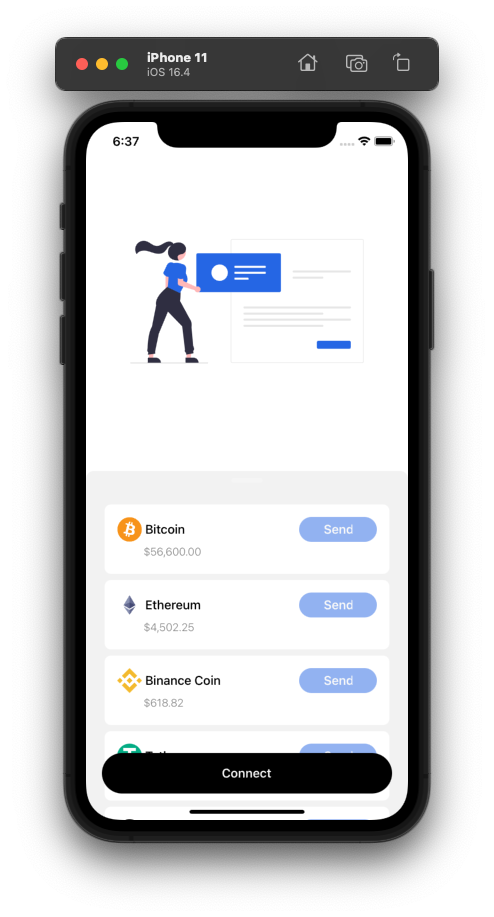

# Kado Mobile Engineer Challenge

This challenge consists of create a creating a React Native mobile app from scratch, and offer seamsly swaps between blockchains uing SquidRouter.

### The Modules

- Storing all global states in a Zustand store
- Storing persistent data in a performant way (mmkv)
- Using a navigation library (React Navigation)
- Adding a splash screen & app icon
- Adding onboarding screens with animations
- Adding translations (i18n)
- Adding a theme provider (styled-components)
- Adding a global performance monitoring tool (react-native-performance)

## Simple React Native App Structure

```bash
    |- app/                    # Main entry point of the app's code
      |- analytics             # Analytics hooks to be used in the app
      |- navigation            # Navigation files
      |- components            # Components
         |- index.ts           # Central export file for all components
         |- atoms              # Atoms: Smallest components
         |- molecules          # Molecules: Components composed of atoms
         |- organisms          # Organisms: Components composed of molecules
      |- screens/              # Screens
         |- index.ts           # Central export file for all screens
         |- screen-name/       # Screen name defining usually a module/concern of the app
            |- index.ts        # Main wrapper of the screen
            |- utils/          # Local utils for the screen
      |- globalState/          # Zustand State (Global State Management)
      |- services/             # External services (API, Storage, etc)
      |- utils/                # Global utils (Helpers, etc)
      |- types/                # Global Types
```

> Note: This structure was built to best fit challenge's requirement. The structure could be different if it was a real app.

## Build and Run the app (Optional)

If you would like to build the app to be able to test it, just run:

```bash
yarn
```

### iOS

```bash
yarn ios
```

### Android

```bash
yarn android
```

Note: Make sure you are using node version ˆ18.0.0 and follow the instructions on the [React Native Docs](https://reactnative.dev/docs/environment-setup) to setup your environment.

<!-- ## Demo

 -->

## Screenshots




